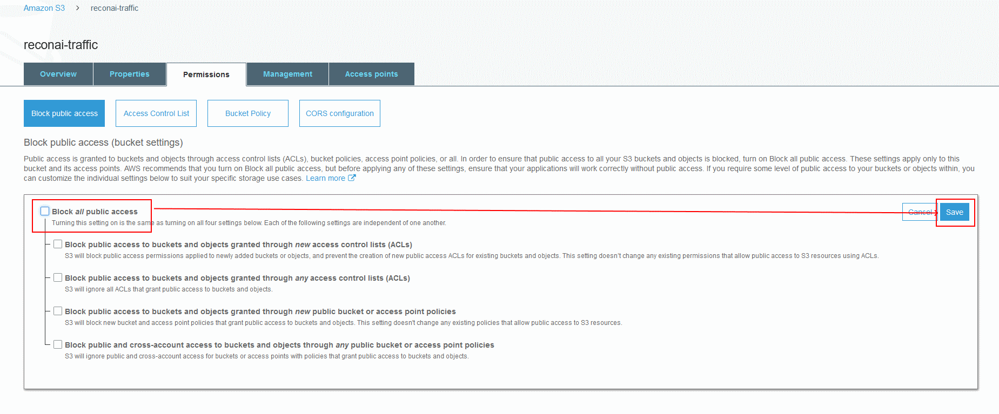
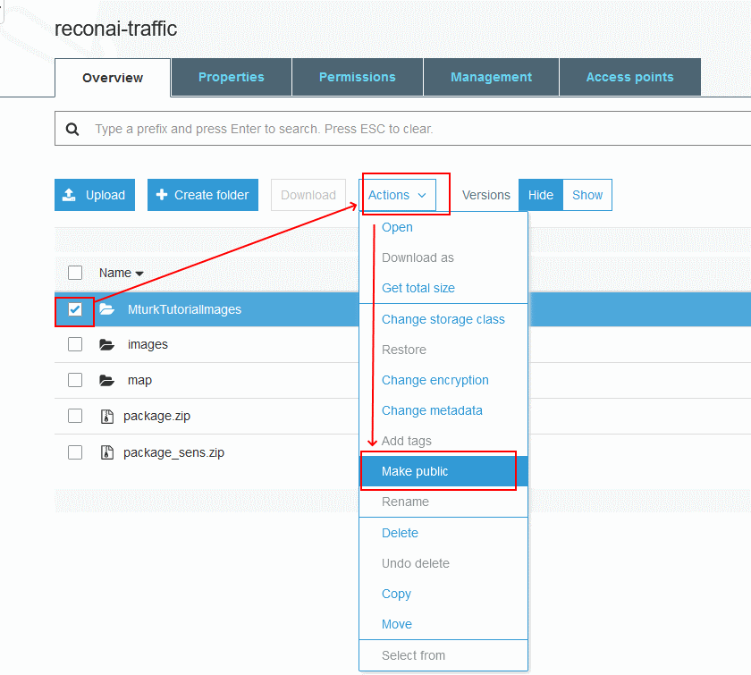

# Data Preparation
This part of repository provides instructions and scripts on 'how-to': 
1. Save data in AWS S3
2. Be able to download samples for review
3. Prepare batch dataset ready for annotation
 
*To execute some scripts you have to obtain credentials.py file
 

## 1. Save data in AWS S3 bucket

On this step you just have to create an S3 bucket, upload data in ther and Disable 'Block all public access'. 
Optionally if your dataset is not private, then you can follow publishing steps. 
Instructions are provided below. 

[Basic instruction](https://blog.mturk.com/tutorial-how-to-label-thousands-of-images-using-the-crowd-bea164ccbefc)   

If you already have S3 bucket with data, follow the steps below:

 
 
 

Test a link to the file in separate browser and ensure that file is available. 

## 2. Be able to download samples for review

Scripts '[01_discover.py](https://github.com/ReconAI/MturkAnnotation/blob/master/0_Prepartion/01_discover.py)' and '[02_imageList.py](https://github.com/ReconAI/MturkAnnotation/blob/master/0_Prepartion/02_imageList.py)' are using [Boto3](https://boto3.amazonaws.com/v1/documentation/api/latest/index.html) library to check the contents of S3 bucket and download sample images for visual review. 
From visual review you can prepare a document similar to [CamerasAnnotation.xlsx](https://github.com/ReconAI/MturkAnnotation/blob/master/0_Prepartion/result/CamerasAnnotation.xlsx) containig list of all cameras with the classification of their parameters (type of camera, highway/country/road view and etc.) 
XSLT file can be exported in [CamerasAnnotation.csv](https://github.com/ReconAI/MturkAnnotation/blob/master/0_Prepartion/result/CamerasAnnotation.csv) for furthere handling using [Pandas](https://pandas.pydata.org/docs/).

## 3. Prepare batch dataset ready for annotation

As mentioned in item #2, [CamerasAnnotation.csv](https://github.com/ReconAI/MturkAnnotation/blob/master/0_Prepartion/result/CamerasAnnotation.csv) can be parsed using [Pandas](https://pandas.pydata.org/docs/) and batches of data can be picked for further processing using '[03_parseAnnotationFile.py](https://github.com/ReconAI/MturkAnnotation/blob/master/0_Prepartion/03_parseAnnotationFile.py)'.  
As the result you would get a file like '[linksDataset_100.csv](https://github.com/ReconAI/MturkAnnotation/blob/master/0_Prepartion/result/linksDataset_100.csv)' which can be used as an input for [Annotation](https://github.com/ReconAI/MturkAnnotation/tree/master/1_Annotation)
