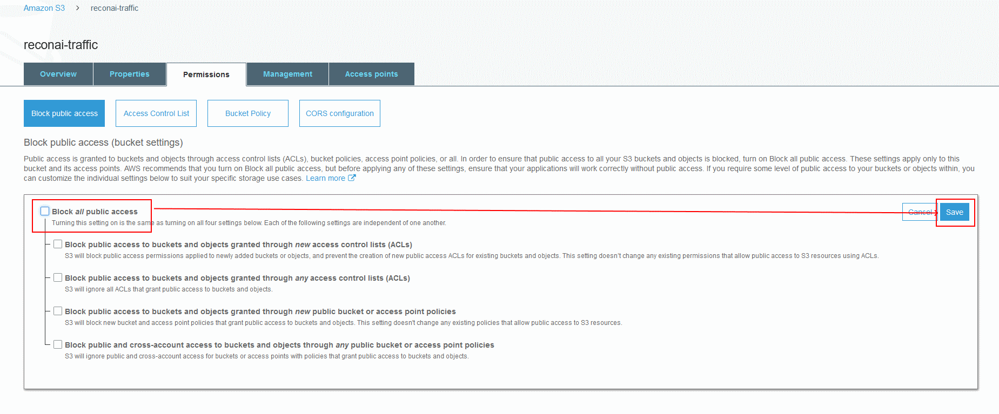
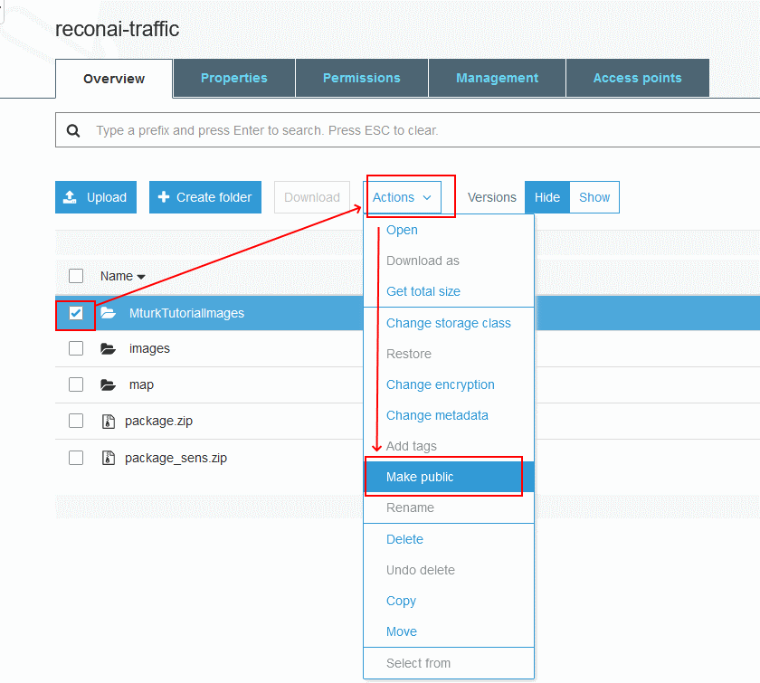
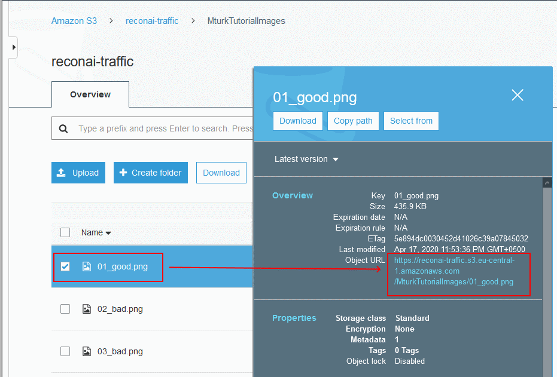

# MturkAnnotation
Documentation and Instructions for MTruk with helpful scripts  

 

## Sequence of actions:

0. See Data Preparation
1. Run 01_DownloadDataset.py. It will create S3Dataset.csv - a raw list of all image urls
2. Run 02_AlterDataset.py. It will create Dataset.csv - file which would be used as a final data storage (img_urls, annotations, remarks isAnnotated, threadNumbers). Enable REMOVE_BAD_IMAGES to delete images from sightseeing cameras and close-road-view cameras
3. Run 03_SendToAnnotation_multi.py it will create 01_Thread#_Batch.csv (list of all batch images to be annotated) and 02_Thread#_AnnotationInput.csv (file which has to be uploaded to Mturk Annotation Multi project). Also script will make images related to the Thread #X public. Don't forget to change thread #!
4. (MTurk) Create MTurk detection project with 5 images per task (see MTurkProjects/04_BoundingBoxes_DTF_Multi5)
5. (MTurk) Upload 02_Thread#_AnnotationInput.csv in Mturk, launch annotation task
6. (MTurk) Download Thread annotation result file (format: Batch_3998716_batch_results.csv). Rename to 03_Thread#_AnnotationOutput.csv
7. Run 04_SendToValidation_multi.py, specify number of annotation images (5) and number of validation images (10) per task, get 04_Thread#_AnnotaionOutput_SingleCol.csv (list of all annoations in a single column) and 05_Thread#_ValidationInput.csv (input file for a validation task)
8. (MTurk) Create MTurk Tier 2 project with (NUMBER!) images per task
9. (MTurk) Upload 05_Thread#_ValidationInput.csv in Mturk, launch validation task
10. (MTurk) Download Thread validation result file (format: Batch_3998716_batch_results.csv). Rename to 06_Thread#_ValidationOutput.csv
11. Run 05_RankAnnotation_multi.py, specify number of images per annotation (5) and validation (10) tasks, get 07_Thread#_ValidationOutput_SingleColumn.csv (Output file in one column [url, annot, category]), 08_Thread#_ValidationOutput_Summary.csv (summary on each annotation, grouped by Score), 09_Thread#_AnnotaionRankInput.csv (Ranking file for Mturk annotation task)
12. (MTurk) Upload 09_Thread#_AnnotaionRankInput.csv to Annotation task results review (Disable [] Republish rejected assignment(s) for other Workers to complete)
13. (MTurk) Close annotation task
14. Run 06_UpdateDatabase.py, input is 08_Thread#_ValidationOutput_Summary.csv and Database.csv, script will update Database.csv with correct annotations, erase threadNumber, set isAnnotated and make public images private
17. Save Thread# Annotation and Validation output files as well as 08_Thread#_ValidationOutput_Summary, remove the rest %Thread#% files

## File samples

1. S3Dataset.csv - list of links to images from S3 Bucket
2. Dataset.csv - S3 image links with annotation, threadNumber and isAnnotated columns
3. 01_Thread#_Batch.csv - N images from Dataset.csv
4. 02_Thread#_AnnotationInput.csv - 01_Thread#_Batch.csv in Mturk Tier 1 input format (N columns)
5. 03_Thread#_AnnotationOutput.csv - Mturk Tier 1 output (N columns)
6. 04_Thread#_AnnotaionOutput_SingleCol.csv - Mturk Tier 1 output (1 column)
7. 05_Thread#_ValidationInput.csv - Mturk Tier 2 input (M columns)
8. 06_Thread#_ValidationOutput.csv - Mturk Tier 2 output (M columns)
9. 07_Thread#_ValidationOutput_SingleColumn.csv - Mturk Tier 2 output (1 column)
10. 08_Thread#_ValidationOutput_Summary.csv - Summary of Mturk Tier 2 output (1 column)
11. 09_Thread#_AnnotaionRankInput.csv - Mturk Tier 1 Annotation Rank input

## Common Issues

1. Sometimes tasks get frozen, this usually happens when images are failing to load, for example when there are 'bad' images from not-working cameras. In this cases you have to monitor such task or some of annotators might sent you an email about the issue.

# Data Preparation
This part of repository provides instructions and scripts on 'how-to': 
1. Save data in AWS S3
2. Be able to download samples for review
3. Prepare batch dataset ready for annotation
 
*To execute some scripts you have to obtain credentials.py file
 

## 1. Save data in AWS S3 bucket

On this step you have to create an S3 bucket, upload data in ther and Disable 'Block all public access'. 
Optionally if your dataset is not private, then you can follow publishing steps. 
Instructions are provided below. 

[Basic instruction](https://blog.mturk.com/tutorial-how-to-label-thousands-of-images-using-the-crowd-bea164ccbefc)   

If you already have S3 bucket with data, follow the steps below:

 
 
 

Test a link to the file in separate browser and ensure that file is available. 

## 2. Be able to download samples for review

Scripts '[01_discover.py](https://github.com/ReconAI/MturkAnnotation/blob/master/misc/01_discover.py)' and '[02_imageList.py](https://github.com/ReconAI/MturkAnnotation/blob/master/misc/02_imageList.py)' are using [Boto3](https://boto3.amazonaws.com/v1/documentation/api/latest/index.html) library to check the contents of S3 bucket and download sample images for visual review. 
From visual review you can prepare a document similar to [CamerasAnnotation.xlsx](https://github.com/ReconAI/MturkAnnotation/blob/master/results/CamerasAnnotation.xlsx) containig list of all cameras with the classification of their parameters (type of camera, highway/country/road view and etc.) 
XSLT file can be exported in [CamerasAnnotation.csv](https://github.com/ReconAI/MturkAnnotation/blob/master/results/CamerasAnnotation.csv) for furthere handling using [Pandas](https://pandas.pydata.org/docs/).

## 3. Prepare batch dataset ready for annotation

As mentioned in item #2, [CamerasAnnotation.csv](https://github.com/ReconAI/MturkAnnotation/blob/master/results/CamerasAnnotation.csv) can be parsed using [Pandas](https://pandas.pydata.org/docs/) and batches of data can be picked for further processing using '[03_parseAnnotationFile.py](https://github.com/ReconAI/MturkAnnotation/blob/master/misc/03_parseAnnotationFile.py)'. 

## ToDo

1. FOLDER PER EACH THREAD 
2. Visualization tool - save random N images with annotation (publish -> unpublish)
3. Add execution time per each script
4. Boto3 - fast image publising/privating
5. Better comments to navigate over scripts or modular/functional structure

