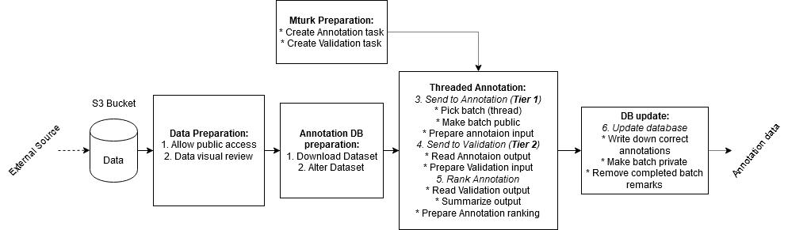

# MturkAnnotation
Documentation and Instructions for MTruk with helpful scripts  

 

## Project structure

1. [Data preparation](https://github.com/ReconAI/MturkAnnotation/tree/master/0_Prepartion)
2. [Data annotation](https://github.com/ReconAI/MturkAnnotation/tree/master/1_Annotation)
3. [Data validation](https://github.com/ReconAI/MturkAnnotation/tree/master/2_Validation)
4. [Data postprocessing](https://github.com/ReconAI/MturkAnnotation/tree/master/3_Finalization)
